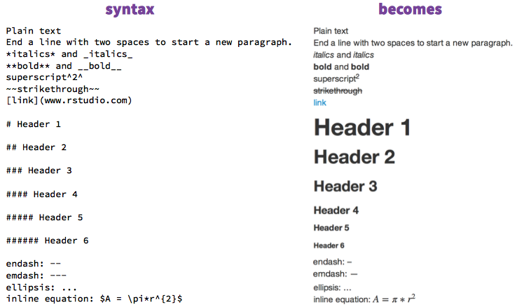
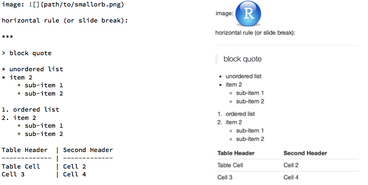
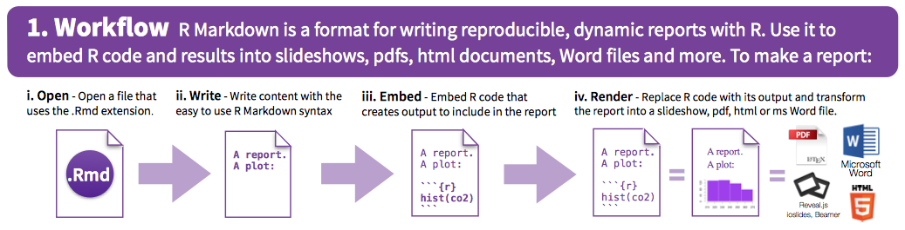
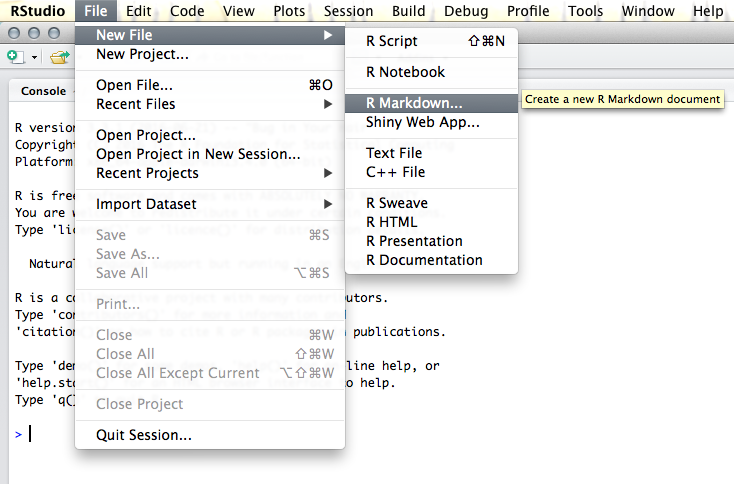
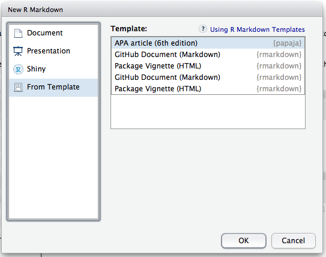

```{r setup, include=FALSE}
knitr::opts_chunk$set(echo = FALSE)
```

## What will we do today?

* Basics: What is RMarkdown
* Setting up: What do you need for an R Markdown document?
* Example: A simple interactive data report
    + Importing data
    + Text and code
    + Tables
    + Plots
* Different styles: Transforming your report into an APA paper
* Bonus: Citations


## What is RMarkdown?

Markdown: Text formatting language (think Latex)  


Note: You don't directly see the output of your work! 

"knit" for a final product

***
Syntax, pt 1
(You find them all on the RMarkdown cheatsheet)




***
Syntax, pt 2



***
Workflow:




## Creating an RMarkdown document




***

The next steps are a practical introduction, which I recount here for those who could not make it. We went through the steps creating the HelloWorld document in this repository.

First, as shown in the previous slide, make a new RMarkdown document. 

Once you have have entered a title (for example "Hello World") and clicked ok, a new document appears which has a **title section** on top. This section contains some core properties of the document (as we will see later it gets longer as we want to control more about how the document looks). For now, it contains the title, an author name, and what you want it to become after "knitting": html, pdf, or docx. Try changing the output between formats. 

The document body contains text (in markdown format, so it does not appear he way it will in the final document) and code. How to format the text is described in the cheatsheet, just try a few things. 

*** 

**Section headers** are marked with # or multiple #. The more you add, the lower the section. Section headers are very useful when trying to navigate an RMarkdown document, you can just jump to specific section using the menu at the right bottom of the editor window (yellow square with a #). 


***

**Code chunks** are marked with ```. Note that it is not ' and it might be tricky to find this key on your keyboard. If you cannot find the key, use the top right chunk button (green square with a c) or try a shortcut to insert code chunks: On Windows machines it is Ctrl+Alt+i.

Code chunks are highlighted and require that you specify the code language within {}, simply by typing r. This is important, because RMarkdown documents can also contain and evaluate other types of code (for example python), see the chunk button options. 

There are two more parts that you can optionally add to code chunks, a chunk name (after r, separated only by a blank), and some instructions how the chunk should behave. Chunk names are useful as they allow you to navigate the document using the menu at the bottom of the editor window in RStudio. If you do not specify a name, chunks will be numbered. If you have many chunks, names will make your life much easier.

The additional specifications regulate how to evaluate the code in this chunk. You can also set some things globally, in the HelloWorld document for example the very first chunks sets code display to FALSE by default. More information on the different options can be found here: http://rmarkdown.rstudio.com/authoring_rcodechunks.html 


***

**Actual code** must be *working* R code, because otherwise it will not be 'understood' and no final document can be knit. If you want to actually discuss code that does not work or if you want to work on another part of your document, type within the {} echo=TRUE to display code and eval=FALSE, separated by a comma.

Code chunks are evaluated consecutively like one large script, so if you read in data in chunk 2, chunk 3 can display or modify this data. You will run into trouble when you accidently move chunks around, though, so that chunk 3 tries to work with data before reading them in. 

You can evaluate this chunk by clicking on the play (green triangle) symbol on the top right corner of this chunk. Note that this is like pasting code into your console. If this chunk of code depends on things that happen in previous chunks, it won't know what to do if you haven't run those chunks before. You can run all chunks before this one by clicking on the middle symbol (grey triangle and light green bar) in the top right corner. In the very top corner, the code chunk button (green square with a c) gives the same options.

If you have a recent version of RStudio, the output of your code will be displayed *in your editor*. This way you can quickly inspect the results of any edits. Otherwise you have to knit and inspect the final document or run the code in the chunks and check your plot window, like when executing a standard R script. 

***

It is best practice to have the first chunk(s) in a document contain all set-up related things, like loading libraries and managing code options. You see this implemented in all example files in this folder. This makes it easier to keep track of things. 

Code can contain things that remain hidden, like reading in data (see the document RMarkdownExample.Rmd and try to knit it) and processing them. You can also generate output like tables and plots.

**Tables** can be formatted to take on the RMarkdown format (see syntax sheet on the previous slides) by wrapping table like output (for example using `head()` or `summary()`) in `kable()` from the library `knitr`. Compare the outputs of `head(comic_data)` to `kable(head(comic_data))` both in the RMarkdown document and in the final product (the pdf or docx). 
There are more options for nice table formatting, as described here: http://rmarkdown.rstudio.com/lesson-7.html  
I think, for beginners it's easiest to start with kable and explore the options it offers. 

***

**Inline code** (for example when you just want to mention a specific value) can be added by enclosing R commands with ` (a single one each) and then stating again that you want to use r in this environment, this time without any {}. This in-line code is useful when talking about data in text, but is does not have all the properties of code chunks, such as modifying whether code will be displayed and giving it names. You thus need to remember where such in-line code is in your document.

The same applies as to code chunk: you can only access data after they have been generated or read in a previous code chunk (or in ine code snippet).

Here is an example of inline code, first displaying the code, and then evaluating it: 

`1+1` equals `r 1+1`


***

**Filepaths** for reading in data or displaying images in your document are specified relative to where the .Rmd itself lives. 
So when you want to access a file living in a subfolder next to your RMarkdown document, say something like 'subfolder/filename.csv', when it is in a paralle folder, try '../foldername/filename.csv'  
This is important when reading in data (within code chunks) or when adding images to your document. I generally recommend Page's folder structure plus an images/ folder for writing projects. See her blog here: https://pagepiccinini.com/r-course/lesson-1-r-basics/

**Images** are entered using the simple `` syntax. RStudio can autocomplete filenames using 'tab'. 


## Things to pay attention to

Markdown is a bit peculiar, sometimes things don't end up looking like you want them to. If so: google!

Examples:

* A new line in the source document does *not* mean a new line in the final document. You need to leave one line blank (as in Latex) or use two spaces
* The sub-list items did not work for me: you need to insert 4 spaces


## Now for the APA format!

If you have managed to install papaja, you should see the following when trying to create a new RMarkdown file from templates:




***

Let's go through the parts and then create our own documents... 

Now first let's look at the generated template file, which should look similar to APA_Template.Rmd in this folder. Try to knit it (you need to have a working TeX version installed for it to yield pdf, but not html or docx).

As I mentioned before, the title part is now much longer, because we need much more information to set up the document, such as the running title and authors/affiliations. There is no introduction section because of how APA works. This makes navigating a bit more tricky, but if you have your set-up code chunk right before you start writing, this can be a bookmark. 

The template already has a typical paper structure, so you can start filling everything in. 

## A longer APA paper example containing text, code, and outputs

To see how a longer APA paper might look, open APA_Untidy_Paper.Rmd. It contains examples of the many things you can do with RMarkdown, and how a longer paper might look like. This will still be much shorter than your typical journal paper. It shows in the pdf version, how everything is now formatted to comply with  APA style (for example the citations and subsections). 

## Comparing a paper with all code in it and a paper with outsourced code

APA_Tidy_Paper.pdf should look exactly like APA_Untidy_Paper.pdf, but the underlying documents are quite different. In the tidy case, I moved all longer code to a separate script and just source this script at the beginning of the document. This makes (to me) the paper more readable, 

## APA Tables

papaja comes with a function to format tables correctly, called 'apa_table()'. Prepare a table by creating a data structure that has exactly the fields you want to display, plus column headers. For advanced users, you can also modify the column headers and other parts of how this table turns out. 

You can look at the code for such table in the RMarkdown document and see how it turns out in differnet output formats. Also look at the data structure that is contained in the table, it shows how to format your data for display (for example using dplyr).

## Citations

* You can add citations and manage them in different formats (e.g. endnote)  
    + I use .bib which (1) can be opened by RStudio and (2) can be exported from google scholar
    + Check the documentation of RMarkdown for citing in text vs in brackets using:
        - `[@Citation]` (brackets) vs 
        - `@Citation` (in text) vs 
        - `[-@Citation]` (just year if you mention author in text).
    + IMPORTANT: Use *;* between multiple citations in the [] context

In the APA template, there is a very practical bit of code at the end. Keep it in and you will generate citations for all loaded R packages automatically. You should always aim to cite ALL R packages that helped you during your research. 

In the title section, you can specify two .bib files, for example one containing your R citations and one referring to papers you mentioned in the text.

Note that there will be complaints when you cite some paper that is not in any of the .bib files you mention!

More info: http://rmarkdown.rstudio.com/authoring_bibliographies_and_citations.html

If you would like an interactive format to add citation, I recommend citr: https://github.com/crsh/citr 

## Some things to know about writing papers

* If you use APA style: papaja is continuosly being improved and your feedback helps!
* As you saw, I like outsourcing scripts and just calling them. 
    + Bonus version: Save everything in an environment and just load that into the paper. Update the environment when you change your analyses, plots, etc.
* I got APA Table to work! YAY! I overlooked that you have to specify results='asis' in the code chunk options, my bad! It IS mentioned on the papaja website.
* There is also a function to correctly format stats, that also didn't work for me (no output or the same problem as APA_table).


## Useful resources

http://rmarkdown.rstudio.com

https://www.rstudio.com/wp-content/uploads/2016/03/rmarkdown-cheatsheet-2.0.pdf

http://stat545.com/block007_first-use-rmarkdown.html

